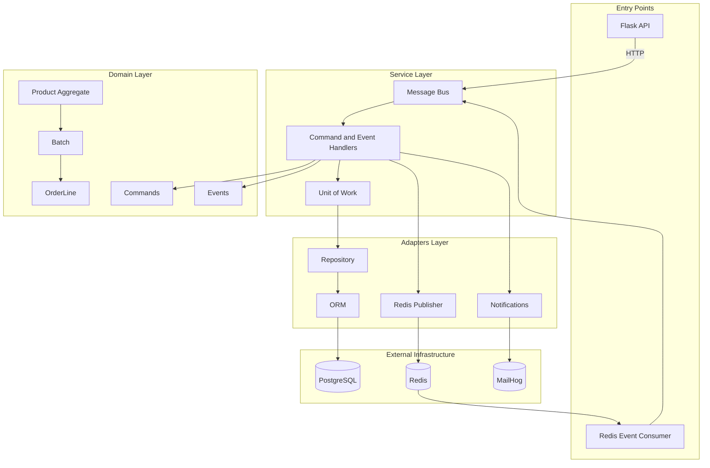
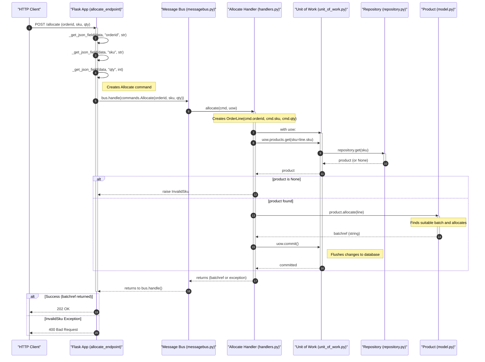
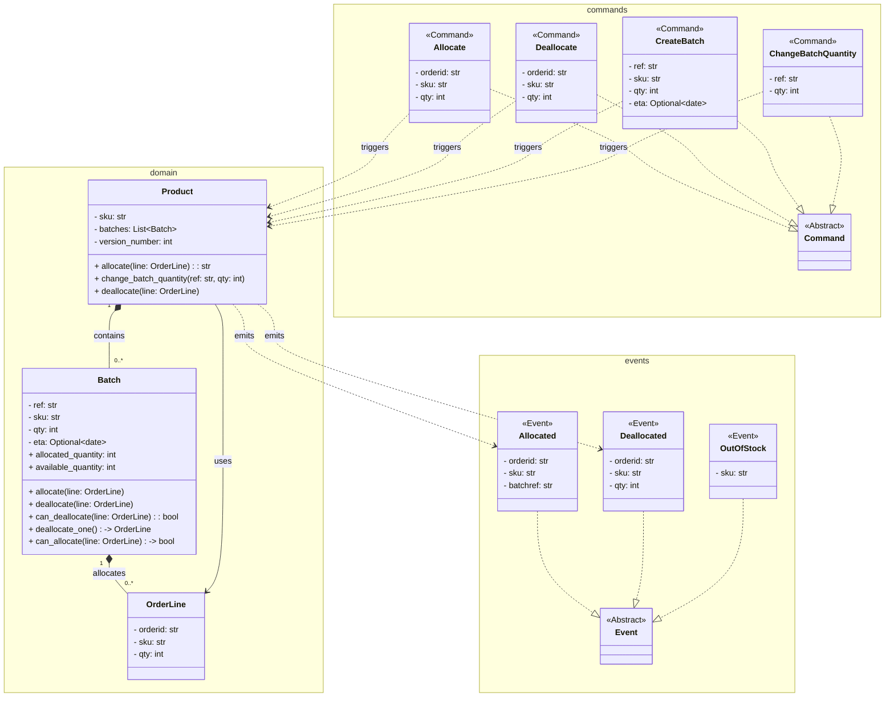
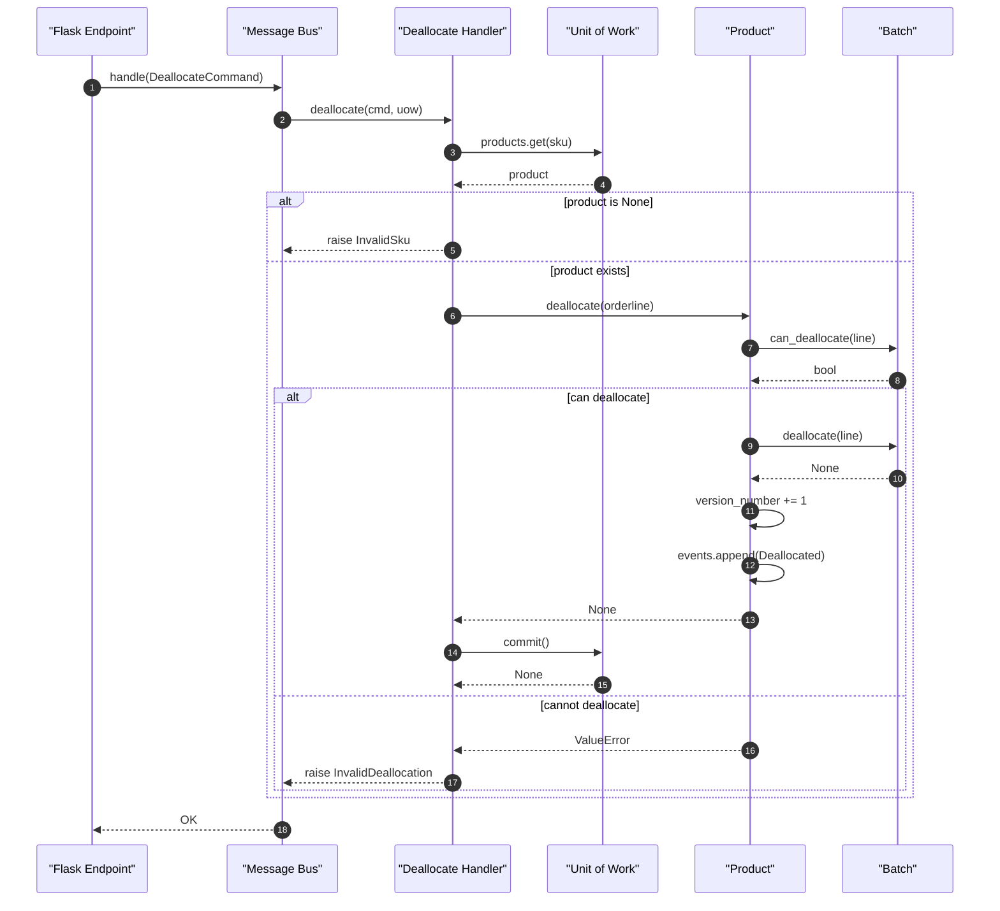
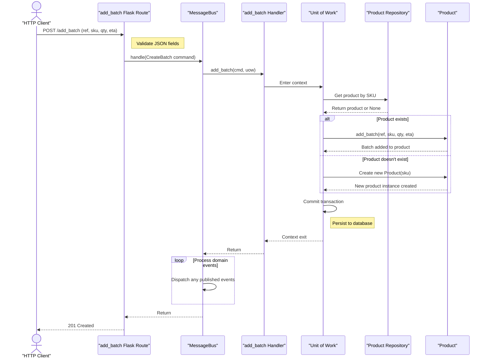

# System Architecture and Design Patterns

> A deep dive into the allocation service's domain-driven design, layered architecture, and the patterns that drive its command/event processing pipeline.

The allocation service implements an inventory management system built on Domain-Driven Design principles. It manages the allocation of order lines to product batches, handling the full lifecycle from batch creation through allocation and deallocation. The system employs a clean separation between domain logic, service layer orchestration, and infrastructure adapters, communicating internally through a message bus that dispatches both commands and domain events.

## Architecture

The system follows a **layered architecture** with clear boundaries between domain logic, application services, and infrastructure concerns. Each layer has a defined responsibility and communicates through well-established DDD patterns.

### Core Components

| Layer | Components | Responsibility |
|-------|-----------|----------------|
| **Domain** | `Product`, `Batch`, `OrderLine` | Core business rules for inventory allocation. `Product` serves as the aggregate root managing batch collections and allocation logic. |
| **Service Layer** | `MessageBus`, command/event handlers | Orchestrates use cases by dispatching commands to handlers, which coordinate domain objects and infrastructure through the Unit of Work. |
| **Adapters** | `SqlAlchemyRepository`, `SqlAlchemyUnitOfWork`, `EmailNotifications`, Redis publisher | Implements abstract interfaces for persistence, notifications, and external event publishing. |
| **Entrypoints** | Flask HTTP API, Redis event consumer | Receives external requests (HTTP and Redis pub/sub messages) and translates them into commands on the message bus. |

### Key Design Patterns

**Repository Pattern** — `AbstractRepository` defines a persistence interface; `SqlAlchemyRepository` provides the concrete implementation. This decouples domain logic from database specifics.

**Unit of Work** — `AbstractUnitOfWork` manages transaction boundaries and tracks new domain events generated during a business operation. `SqlAlchemyUnitOfWork` implements this with SQLAlchemy sessions.

**Message Bus** — The `MessageBus` dispatches both commands (synchronous, imperative operations) and events (reactive, side-effect triggers). Commands are handled by a single handler; events can trigger multiple downstream handlers.

**CQRS (Command Query Responsibility Segregation)** — The system maintains a separate `allocations_view` read model, updated via event handlers (`add_allocation_to_read_model` / `remove_allocation_from_read_model`), queried by the `allocations` view function.



### Data Flow

1. **HTTP requests** arrive at Flask endpoints, which deserialize input and dispatch commands to the message bus.
2. **Redis events** (e.g., `change_batch_quantity`) are consumed by the Redis event consumer and translated into commands.
3. The **message bus** routes commands to handlers, which open a Unit of Work, load aggregates via the repository, execute domain logic, and commit.
4. **Domain events** emitted during command handling (e.g., `Allocated`, `Deallocated`, `OutOfStock`) are collected by the Unit of Work and dispatched back through the message bus.
5. Event handlers perform **side effects**: publishing to external Redis channels, updating the read model, and sending email notifications.



### Domain Model

The domain is centered on three core types:

- **`Product`** — Aggregate root that owns a collection of `Batch` objects. All allocation and deallocation operations go through the product, which enforces invariants and emits domain events.
- **`Batch`** — Represents a replenishment batch with a reference, SKU, quantity, and optional ETA. Tracks allocated `OrderLine` sets and computes available quantity.
- **`OrderLine`** — Value object representing a customer order line (orderid, sku, qty).



### Domain Events

Domain events represent state changes that external consumers react to:

| Event | Trigger | Downstream Effects |
|-------|---------|-------------------|
| `Allocated` | Successful allocation of an order line | Publish to Redis `line_allocated` channel; insert into read model |
| `Deallocated` | Order line removed from a batch | Attempt reallocation to another batch; remove from read model |
| `OutOfStock` | Allocation fails due to insufficient stock | Send out-of-stock email notification |

### Deallocation and Batch Quantity Changes

When a batch quantity is reduced via the `ChangeBatchQuantity` command, the domain may need to deallocate previously allocated order lines. These deallocated lines are then automatically reallocated to other available batches. If no batch can be found with a matching allocation, an `InvalidDeallocation` exception is raised, which the Flask endpoint translates into a `400 Bad Request` response.

Both `Batch` and `Product` expose `deallocate()` and `can_deallocate()` methods that enforce the invariant that only lines present in a batch's allocation set can be removed.



### Batch Addition Flow

New batches are added through the `CreateBatch` command. If the product does not yet exist, a new `Product` aggregate is created. The handler appends the batch to the product's collection and commits.



### Infrastructure Integration

- **PostgreSQL** — Primary data store for products, batches, allocations, and the read model.
- **Redis** — Used for pub/sub messaging: publishing `line_allocated` events and consuming `change_batch_quantity` commands from external systems.
- **MailHog** — SMTP mock for out-of-stock email notifications during development and testing.

## Project Structure

```
src/
├── allocation/
│   ├── domain/                  # Core domain model and events
│   │   ├── model.py             # Product, Batch, OrderLine aggregates
│   │   ├── events.py            # Allocated, Deallocated, OutOfStock events
│   │   └── commands.py          # Allocate, Deallocate, CreateBatch, ChangeBatchQuantity commands
│   ├── service_layer/           # Application service orchestration
│   │   ├── handlers.py          # Command and event handler functions
│   │   ├── messagebus.py        # MessageBus dispatching commands and events
│   │   └── unit_of_work.py      # Abstract and SQLAlchemy unit of work implementations
│   ├── adapters/                # Infrastructure implementations
│   │   ├── orm.py               # SQLAlchemy table definitions and mapper setup
│   │   ├── repository.py        # Abstract and SQLAlchemy repository implementations
│   │   ├── notifications.py     # Abstract and email notification implementations
│   │   └── redis_eventpublisher.py  # Redis pub/sub event publisher
│   ├── entrypoints/             # External interface adapters
│   │   ├── flask_app.py         # Flask HTTP API with route definitions
│   │   └── redis_eventconsumer.py  # Redis pub/sub consumer for external events
│   ├── bootstrap.py             # Application bootstrapping and dependency injection
│   ├── config.py                # Environment-based configuration for all services
│   └── views.py                 # Read model query functions
tests/
├── unit/                        # Domain and handler unit tests
│   ├── test_batches.py          # Batch domain model tests
│   ├── test_product.py          # Product aggregate tests
│   └── test_handlers.py         # Command handler tests with fake dependencies
├── integration/                 # Integration tests against real infrastructure
│   ├── test_repository.py       # Repository persistence tests
│   ├── test_uow.py              # Unit of work transaction tests
│   ├── test_views.py            # Read model view tests
│   └── test_email.py            # Email notification integration tests
├── e2e/                         # End-to-end API and event tests
│   ├── api_client.py            # HTTP client helpers for API testing
│   ├── redis_client.py          # Redis pub/sub client helpers
│   ├── test_api.py              # Full API allocation flow tests
│   └── test_external_events.py  # Redis event consumption tests
├── conftest.py                  # Shared test fixtures (DB, API, Redis setup)
└── random_refs.py               # Random test data generators
├── docker-compose.yml           # Service orchestration (API, Redis consumer, Postgres, Redis, MailHog)
├── Dockerfile                   # Python 3.9 application image
└── requirements.txt             # Project dependencies
```

### Key Directories

- **`domain/`** — Pure domain logic with no infrastructure dependencies. Contains the aggregate root (`Product`), value objects (`Batch`, `OrderLine`), commands, and events.
- **`service_layer/`** — Orchestrates domain operations through the message bus. Handlers coordinate between the repository, unit of work, and external services.
- **`adapters/`** — Implements abstract interfaces defined by the service layer. Swappable for testing or alternative infrastructure.
- **`entrypoints/`** — Translates external protocols (HTTP, Redis pub/sub) into internal commands.
- **`tests/`** — Three-tier testing strategy: unit tests with fakes, integration tests against real databases, and end-to-end tests against the running API.