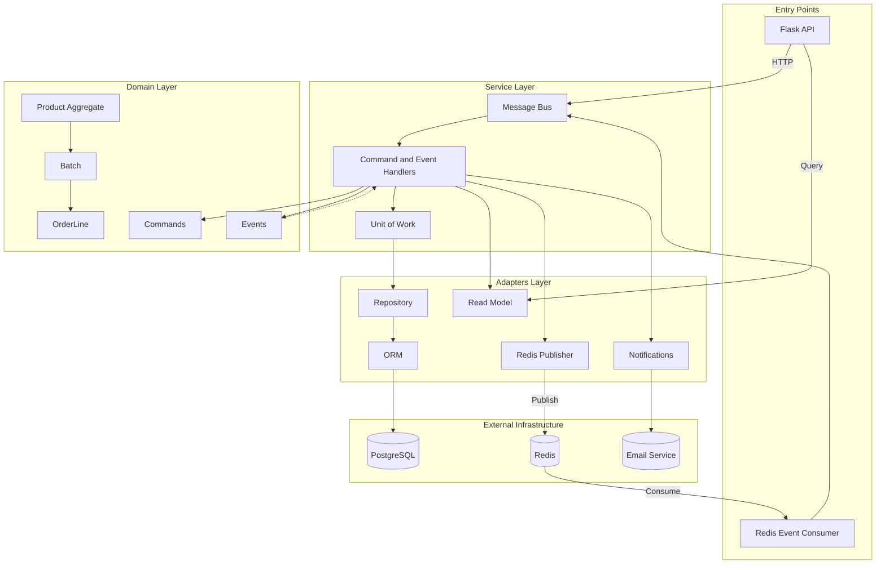
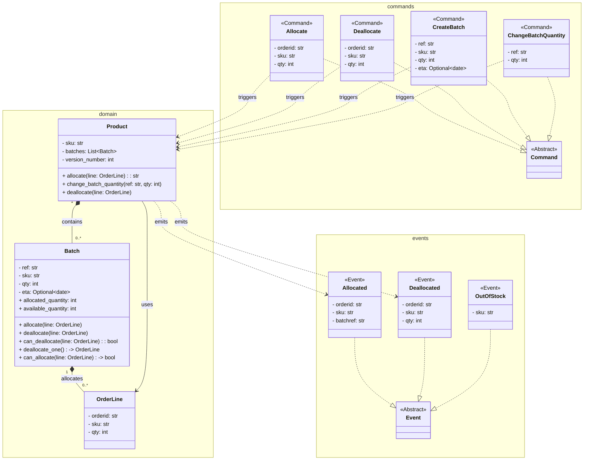
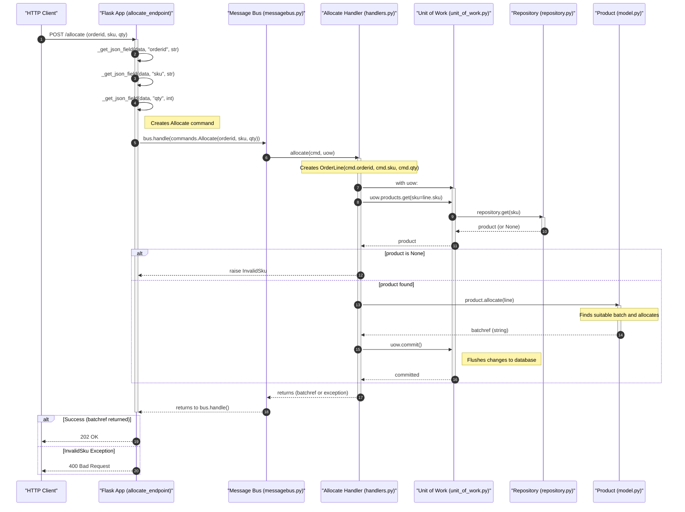
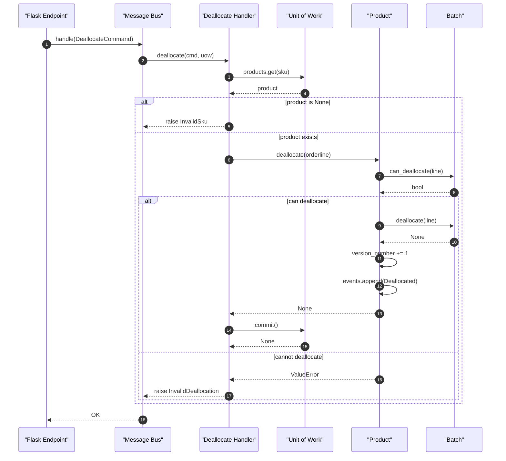
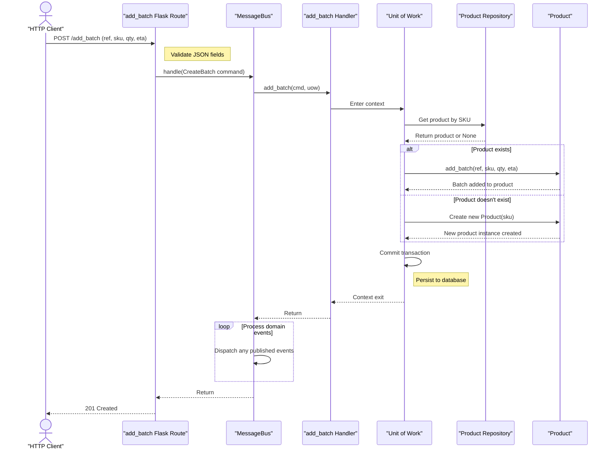

# Development and Testing Guidelines

Development environment setup, testing strategies, and contribution guidelines for the allocation system example application.

This document provides practical guidance for setting up a local development environment, running the test suite across all testing levels (unit, integration, and end-to-end), and contributing to the project. It covers infrastructure requirements, available tooling, test conventions, and the expected workflow for developers working with this codebase.

## Development

### Prerequisites

The application requires the following infrastructure services, defined in `docker-compose.yml`:

| Service | Purpose | Host Port |
|---|---|---|
| PostgreSQL | Primary database | `54321` |
| Redis | Event pub/sub messaging | `63791` |
| MailHog | Email testing (SMTP) | `11025` (SMTP), `18025` (Web UI) |
| API | Flask web server | `5005` |

### Environment Setup

**Option 1: Docker Compose (recommended)**

Start all infrastructure services and the application:

```bash
docker-compose up
```

This launches the API server on `http://localhost:5005` and the Redis event consumer. The PostgreSQL database, Redis, and MailHog services are started as dependencies.

**Option 2: Local Development**

1. Install Python dependencies:

```bash
pip install -r requirements.txt
pip install -e src
```

2. Set the following environment variables to configure service connections:

| Variable | Purpose | Default (from `config.py`) |
|---|---|---|
| `DB_HOST` | PostgreSQL hostname | `localhost` |
| `DB_PASSWORD` | PostgreSQL password | Required |
| `API_HOST` | API server hostname | `localhost` |
| `REDIS_HOST` | Redis hostname | `localhost` |
| `EMAIL_HOST` | MailHog hostname | `localhost` |

3. Run the Flask application:

```bash
FLASK_APP=allocation/entrypoints/flask_app.py flask run --host=0.0.0.0 --port=80
```

4. Run the Redis event consumer in a separate process:

```bash
python src/allocation/entrypoints/redis_eventconsumer.py
```

### Key Dependencies

**Runtime:**
- `sqlalchemy<2` — ORM and database access
- `flask` — Web framework for HTTP entrypoints
- `psycopg2-binary` — PostgreSQL adapter
- `redis` — Redis client for event publishing and consumption

**Development/Testing:**
- `pytest` — Test runner
- `pytest-icdiff` — Improved diff output for test failures
- `mypy` — Static type checking
- `pylint` — Code linting
- `requests` — HTTP client for API tests
- `tenacity` — Retry logic for test infrastructure setup

### Code Quality

Run type checking and linting with:

```bash
mypy src/allocation
pylint src/allocation
```

## Testing

The test suite is organized into three levels under the `tests/` directory, each serving a distinct purpose.

### Test Structure

```
tests/
├── unit/                  # Fast, isolated domain logic tests
│   ├── test_batches.py    # Batch domain model unit tests
│   ├── test_handlers.py   # Command handler unit tests with fakes
│   └── test_product.py    # Product domain model unit tests
├── integration/           # Tests with real infrastructure
│   ├── test_email.py      # Email notification integration tests
│   ├── test_repository.py # Repository persistence tests
│   ├── test_uow.py        # Unit of work transaction tests
│   └── test_views.py      # View query integration tests
├── e2e/                   # Full system tests via HTTP/Redis
│   ├── test_api.py        # API endpoint end-to-end tests
│   └── test_external_events.py  # Redis event consumer tests
├── conftest.py            # Shared fixtures and infrastructure setup
└── random_refs.py         # Random test data generators
```

### Unit Tests

Unit tests verify domain logic in isolation, using fake implementations for all external dependencies. They are fast and require no running infrastructure.

```bash
# Run all unit tests
pytest tests/unit/

# Run a specific test class
pytest tests/unit/test_handlers.py::TestAllocate
```

Key scenarios covered include order line allocation, batch creation, batch quantity changes, deallocation, error handling for invalid SKUs, unit of work commit behavior, and out-of-stock notifications.

### Integration Tests

Integration tests verify component interactions with real infrastructure (PostgreSQL, SQLite, Redis). The `conftest.py` module provides fixtures for database setup, ORM mapper initialization, and infrastructure readiness checks.

```bash
# Run integration tests
pytest tests/integration/
```

These tests use the `sqlite_bus` fixture to bootstrap a message bus backed by SQLite, and include helpers that wait for external services to become available before executing. Integration tests cover repository persistence, unit of work transactions, email notifications, and view queries including allocation view and deallocation behavior.

### End-to-End Tests

E2E tests exercise the full system through the HTTP API and Redis pub/sub. They use the API client helpers in `tests/e2e/api_client.py` and the Redis client in `tests/e2e/redis_client.py`.

```bash
# Run end-to-end tests
pytest tests/e2e/
```

Prerequisites: All Docker Compose services must be running.

### Running the Full Suite

```bash
# Run all tests (unit + integration)
pytest

# Run with verbose output
pytest -v

# Run a specific test by name
pytest -k test_happy_path_returns_202_and_batch_is_allocated
```

### Writing New Tests

- **Unit tests**: Place in `tests/unit/`. Use fake implementations for all external dependencies. Follow existing patterns in `test_handlers.py` for command handler tests.
- **Integration tests**: Place in `tests/integration/`. Use the session factories and fixtures from `conftest.py` to set up database connections.
- **E2E tests**: Place in `tests/e2e/`. Use `api_client` functions for HTTP interactions and `redis_client` for event-based assertions.

Random test data (order IDs, SKUs, batch references) can be generated using the helpers in `tests/random_refs.py`.

## Contributing

### Workflow

1. Fork the repository and create a feature branch.
2. Make changes following existing code patterns and conventions.
3. Add or update tests for any new functionality.
4. Ensure all test levels pass before submitting.
5. Submit a pull request with a clear description of the changes.

### Code Conventions

- Domain logic lives in `src/allocation/domain/` — keep it free of infrastructure concerns.
- Service layer handlers in `src/allocation/service_layer/handlers.py` orchestrate domain operations.
- Adapters in `src/allocation/adapters/` implement external integrations (database, notifications, Redis).
- Entry points in `src/allocation/entrypoints/` define HTTP and event consumers.
- Tests should use the established fake pattern (`FakeRepository`, `FakeUnitOfWork`) for unit-level isolation.

### Reporting Issues

Report bugs and feature requests via the project's issue tracker. Include reproduction steps, expected behavior, and actual behavior when reporting defects.

## System Overview

The allocation system follows a layered architecture with domain models, service layer handlers, adapters, and entrypoints. For a detailed explanation of the architecture, design patterns (Domain-Driven Design, Unit of Work, Repository, Message Bus), and component interactions, see [System Architecture and Design Patterns](ARCHITECTURE.md).



### Domain Model



### Key Flows





